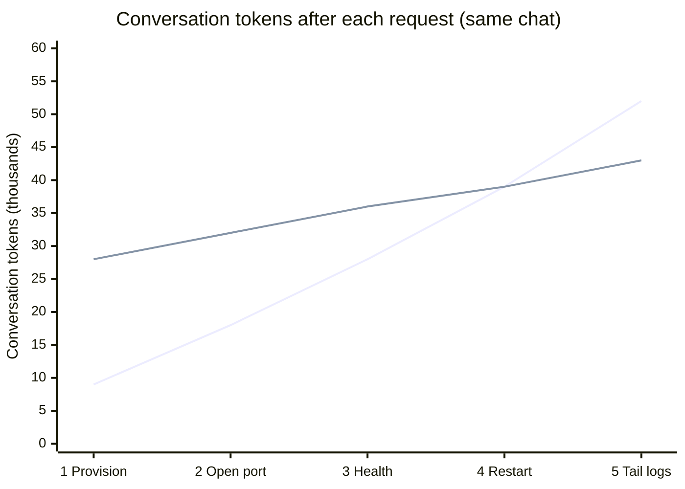

# What an AI agent costs when it does the work itself versus handing it to automation

The MCP server for Red Hat Ansible Automation Platform became generally available in June 2026. It lets an AI tool such as Cursor query your automation controller and launch jobs from a chat prompt. One of the stated reasons to route agents through the platform is token cost.

I wanted a number behind that, so I ran the same developer session two ways and measured what happened to the context window **after each request**.

A note on scope. These figures come from my lab. Your estate will differ. The method is the useful part, and the repo is on GitHub if you want to point it at your own controller.

## The request is a session, not a VM

A developer does not type one line and close the chat. They provision a sandbox, then open a port, then check it is healthy, then restart a service, then read a log. That is one conversation. Every earlier tool result is still sitting in context when they ask the next thing.

I sent five messages in the same Cursor chat. Never named Ansible, AAP, or job templates.

1. I need a RHEL 10 sandbox in eu-west-1 for the payments team with 8 GB of RAM. Install PostgreSQL, harden SSH, and tag it for teardown after 7 days.
2. Open port 8080 from my current public IP.
3. Check the sandbox is healthy.
4. Restart PostgreSQL.
5. Show me the last 50 lines of the PostgreSQL log.

The number that matters is **conversation tokens after each request**. Cursor's panel also shows ~13K of IDE tool definitions. Both arms pay that. I ignore it.

## Two ways to answer it

**Arm A — the agent does it itself.** Shell, AWS CLI, SSH. Every command's stdout lands in the chat and is paid for again on the next turn. `dnf install` is a transaction table. `aws ec2 run-instances` is a JSON blob. `journalctl` is log lines. None of it leaves.

**Arm B — the agent delegates.** AAP MCP only. It searches a 20-template catalog, launches a job, and reads `status` plus a short `artifacts.result`. Playbook output stays in the controller. The catalog is rent: you pay it up front, on request one.

Same model, same five messages, same AWS account. Only the tool surface changes.

## The shape you should see

Request one is the worst case for automation. The shell agent runs a handful of CLI commands. The AAP agent reads a catalog and speaks JSON-RPC. In my lab the shell agent was cheaper on that first call. That is not a failure of the method. It is the fixed cost.

What you want is the inflection: the request where the shell line crosses above AAP and keeps climbing, because stdout compounds and job status does not.



[[FIGURE-CROSSOVER]] Replace the schematic line with measured conversation tokens from the session. The crossover is the published result, not request one's total context. If the lines never cross by request five, print that. Do not pad the VM until they do.

The widget in `widget/context-growth.html` is the same chart as a slider: one tick per request, not per hidden tool call.

## Why 20 templates?

A scoped developer catalog is 15–25 items. Twenty is realistic, not a claim about a typical estate. Five of those templates have real playbooks so requests 2–5 are like-for-like. The other 15 exist so search is still a genuine selection problem.

NOTE: Do not mention Ansible, AAP, or job templates in the prompts.

## What the shell agent does

It works. After request one it has AMI JSON, security-group JSON, `dnf` output, and sshd edits in context. Each follow-up appends more AWS CLI and SSH. By request five the log tail is still sitting there for every later turn, even if nobody asks again.

## What the AAP agent does

Request one: search catalog, launch Provision Dev Sandbox (`memory_gb` is the string `"8"`), poll until `successful`, read a short artifact. Requests two to five: search, launch, status. It should not pull playbook stdout on success.

```plaintext
job_templates_list(search="sandbox")
job_templates_launch_create(...)
jobs_retrieve(id=...)  → status, artifacts.result
```

## The numbers

[[RUNS]] session runs per arm, [[MODEL]], prompt caching off. Conversation tokens only. Medians.

| After request | Shell agent | AAP agent |
|---|---|---|
| 1 Provision | [[CONV-A-1]] | [[CONV-B-1]] |
| 2 Open port | [[CONV-A-2]] | [[CONV-B-2]] |
| 3 Health | [[CONV-A-3]] | [[CONV-B-3]] |
| 4 Restart | [[CONV-A-4]] | [[CONV-B-4]] |
| 5 Tail logs | [[CONV-A-5]] | [[CONV-B-5]] |
| Crossover | [[CROSSOVER]] | — |

First-request totals including IDE tool definitions: [[CONTEXT-A-1]] vs [[CONTEXT-B-1]]. Those are not the comparison. They mix Cursor's tax with the thing being measured.

## Where the cost comes from

The AAP agent pays a catalog and protocol tax once per session. The shell agent pays for evidence on every step, then pays to re-read it forever. One VM hides that. Five requests in one chat shows it.

This is not about AAP being faster. It is about which bytes re-enter the model.

## What I did not measure


**Prompt caching.** It was off for both arms. Turn it on and the gap narrows, because the shell agent's growing history is a cacheable prefix within a session. Caching does not change the token count, only the price of the repeated part.

**The cost of building the automation.** I treated AAP as already present. If you are buying the platform to do this, the subscription belongs in your sums, and the playbook behind the template was written by someone. The comparison assumes you already have automation and asks what it costs to put an agent in front of it.

**Governance.** The shell agent can do anything the AWS credentials allow. The AAP agent can only do what the templates expose. That is a security argument, not a cost one, but it is worth noting that the cheaper path is also the more governed one.

## The wider evidence

This is one test in one lab, but the pattern it shows is not isolated. A growing body of industry evidence says the same thing: most of what enterprises are calling AI use cases are automation problems, and treating them as AI problems is burning budget.

**Leaders are collecting hundreds of use cases — and most do not need an agent.** Cutter's CEO Insights 2025 found that enterprise engineering organisations have "hundreds of AI use cases in active development at any given time," but the gap between development and production is enormous. Most are stuck in what Cutter calls a proof-of-concept trap: a pilot succeeds in isolation, the investment splits across more pilots, and nothing crosses the production threshold [1]. An analysis of production AI deployments estimates that roughly 90 percent of them do not require dynamic agent orchestration — they are classification, extraction, summarisation, or API-call tasks that are fundamentally workflow problems dressed in agent clothing [2].

**Anthropic's own usage data confirms it.** The Anthropic Economic Index, based on a privacy-preserving analysis of one million API transcripts, found that 97 percent of tasks represented in enterprise API traffic show automation-dominant patterns. Seventy-seven percent of enterprise API transcripts were classified as automation rather than augmentation. The dominant use cases are routine back-office workflows: email management, document processing, scheduling, and code generation [3][4].

**The cost difference is not marginal.** For structured, high-volume tasks, deterministic automation runs at roughly $0.001–$0.005 per transaction. An AI agent performing the same work costs $0.02–$0.10 per transaction — ten to twenty times more. Gartner estimates that RPA delivers 30–200 percent ROI in the first year for structured, rule-based processes, a benchmark AI agents rarely match on pure repetition tasks because of their higher inference costs [5][6][7]. The premium buys reasoning. If the task does not need reasoning, it buys nothing.

**The budget is growing, but the ROI is not keeping up.** Writer's 2026 Enterprise AI Adoption survey of over 1,600 employees and executives found that 79 percent of organisations face challenges adopting AI — a double-digit increase from 2025 — and 59 percent invest over one million dollars annually in AI technology. Yet only 29 percent report significant organisational ROI. Fifty-four percent of C-suite executives admit that adopting AI is tearing their company apart [8].

**Gartner warns that over 40 percent of agentic AI projects will be cancelled by end of 2027**, typically because teams underestimate the cost, the oversight required, or both. The guidance is explicit: many enterprise tasks do not require reasoning, and deterministic automation is cheaper, safer, faster, easier to audit, and more predictable for those tasks [9].

**When organisations audit properly, the majority of recoverable value comes from process change, not AI.** A seven-day AI diagnostic at an Irish distributor identified €560,000 in recoverable value. The majority required workflow redesign using existing tools — not AI. Where AI was recommended, it was for specific, well-defined tasks only after the underlying process was stable. The workflow drift alone, fixable without AI, was worth €180,000 per year [10].

The context window test in this article gives you the mechanism. These figures give you the scale. Redirecting the automation-shaped use cases to actual automation — and reserving agent reasoning for the work that genuinely needs it — is not just an architectural preference. It is the difference between a programme that compounds and one that stalls.

## What this means for applied AI

There is a temptation to think of automation platforms and AI agents as alternatives — that the agent replaces the automation. This test shows the opposite, and the industry data confirms it: the automation is what makes the agent viable, and most of the use cases landing on leaders' desks are automation problems to begin with.

Without automation behind it, the agent fills its context window with command output, reinvents processes that already exist, and produces results that vary with whatever the model decides at the time. It works, but it is expensive, ungoverned, and fragile. It does not scale past one-off tasks. Multiply that by the hundreds of use cases an enterprise is trying to ship, and you have a programme that burns budget at ten to twenty times the rate it needs to.

With automation behind it, the agent becomes an interface layer. It takes a request in natural language, maps it to the right piece of tested automation, and delegates. The context window stays small. The process is repeatable. The credentials never leave the platform. The audit trail is the job log, not a chat transcript.

If you are building AI into operations — whether that is developer self-service, incident response, compliance, or anything else that touches infrastructure — the question is not whether to use an agent or automation. It is how quickly you connect the two. The agent without automation is a demo. The agent with automation is a product. And the fastest way to show ROI on your AI investment may be to redirect the automation-shaped use cases to the automation platform you already own.

## Practical advice

- **Measure a session, not a VM.** The first call is the catalog tax. The crossover is the result.
- **Keep the catalog scoped.** Twenty templates is cheap-ish to search. Four hundred is not. Use RBAC.
- **Write descriptions for a model.** Include survey types (`memory_gb` is `"8"`, not `8`).
- **Do not pull playbook stdout on success.** Status and a short artifact are the MCP contract you are measuring.
- **Measure your own estate.** The repo is at [[REPO-URL]].

## References

[1] Axccelerate, "Why Enterprise AI Stalls: What the 13% Do Differently," citing Cutter Consortium CEO Insights 2025. https://axccelerate.com/blog/why-enterprise-ai-stalls-what-the-ready-do-differently

[2] M. Nasternak, "Agent Is Not What You Need," 2025. https://michalnasternak.medium.com/agent-is-not-what-you-need-1c48e37d9b22

[3] Anthropic, "Anthropic Economic Index report: Economic primitives," January 2026. https://www.anthropic.com/research/anthropic-economic-index-january-2026-report

[4] Anthropic, "Anthropic Economic Index report: Uneven geographic and enterprise AI adoption," arXiv:2511.15080, 2025. https://doi.org/10.48550/arxiv.2511.15080

[5] "AI Agents vs RPA: The Definitive Enterprise Decision Guide 2026." https://vitaloralife.com/ai-agents-vs-rpa/

[6] "AI Agents vs Automation: What Handles Complex Tasks," Zero In Daily. https://zeroindaily.com/ai-agents-vs-traditional-automation-complex-tasks/

[7] "AI Agents vs RPA: Which Should You Choose?" PUNKU.AI. https://www.punku.ai/blog/ai-agents-vs-rpa

[8] Writer, "Enterprise AI adoption in 2026: Why 79% face challenges despite high investment." https://writer.com/blog/enterprise-ai-adoption-2026/

[9] R. Singh, "The New Enterprise AI Operating Model," citing Gartner predictions on agentic AI project cancellations. https://www.raktimsingh.com/autonomy-allocation-enterprise-ai/

[10] Acuity AI, "How a Seven-Day AI Diagnostic Recovered €560K for an Irish Distributor." https://acuityai.co/blog/seven-day-ai-diagnostic-recovered-560k
